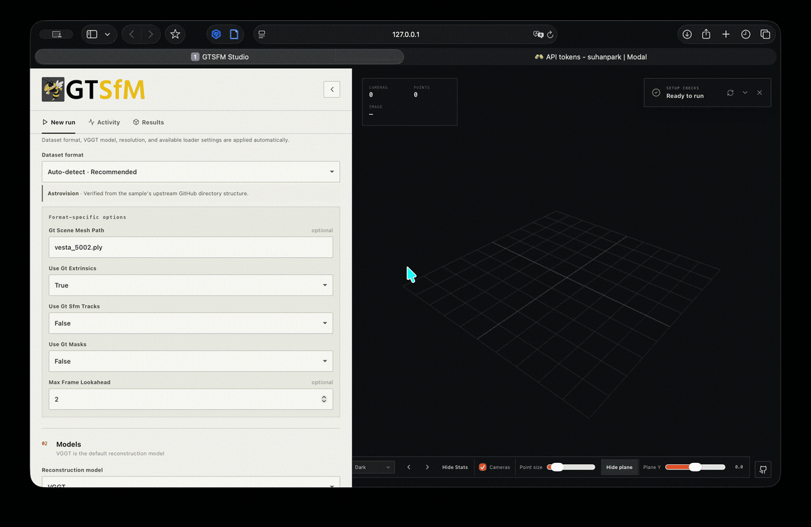

GTSFM Studio v0.0.2 Patch Notes

- Added gtsfm run, which launches a browser-based workspace for configuring and running reconstructions.
- Added built-in GTSFM GitHub samples, and automatic dataset-format detection.
- Added setup checks for dependencies and optional components.
- Added preset-aware Hydra controls that update with the selected model, plus JSON configuration import with a generated template and validation.



| Interface control | Resulting mapping | Relationship |
|---|---|---|
| Reconstruction model | `--config_name vggt` → `hydra.compose(config_name="vggt")` | Direct preset selection |
| Generated model parameter | Exact dotted key, e.g. `cluster_optimizer.geometry_transformer.config.confidence_threshold=6.5` | One-to-one |
| Gaussian preset | `--gaussian_splatting_config_name base_gs` → separate Hydra composition | Direct preset selection |
| Generated Gaussian parameter | `opacity_reg=0.01` → `gaussian_splatting_optimizer.cfg.opacity_reg=0.01` | Semantically one-to-one, but the backend adds the path prefix |
| Training steps | `gs_max_steps=7000` → `gaussian_splatting_optimizer.cfg.max_steps=7000` | Friendly alias |
| Share camera intrinsics | Toggle → `cluster_optimizer.multiview_optimizer.bundle_adjustment_module.shared_calib=True` | Friendly alias |
| Dataset format: Auto | Examines the directory and selects a loader plus loader overrides | Interpreted |
| Expert Hydra overrides | Passed through unchanged after Hydra validates them | Fully one-to-one |
| JSON configuration | Converted into model, Gaussian, and expert override sections | Interface schema, not a raw Hydra config file |
| Hardware, Modal VM, preview interval | Process/environment/workspace settings | Not Hydra |

The JSON prompt also performs interpretation. It accepts:
```json
{
  "model": {
    "cluster_optimizer.geometry_transformer.config.confidence_threshold": 6.5
  },
  "gaussian": {
    "means_lr": 0.00016
  },
  "expert": [
    "some.exact.hydra.key=value"
  ]
}
```