# Densify Module of GTSFM

#### Usage

* At gtsfm root directory, `python gtsfm/runner/run_scene_optimizer_densify.py`
* API
  * ```python 
    from gtsfm.densify.mvsnets.mvsnets import MVSNets

    MVSNets.densify(sfm_result.sfm_data, 
                    image_path=os.path.join(DATA_ROOT, "set1_lund_door"), 
                    image_extension="JPG",
                    view_number=5,           # number of views as inputs of mvsnets
                    thres=[1.0, 0.01, 0.8])  # [geometry_pixel_threshold, geometry_depth_threshold, photo_threshold]
    ```
* output path `results_densify/outputs/`
  * `results_densify/outputs/scan1/confidence`: .pfm confidence map from each view
  * `results_densify/outputs/scan1/depth_est`: .pfm expected depth map from each view
  * `results_densify/outputs/scan1/depth_img`: heatmap (.png) files of (.pfm) files above (grayscale images with .npy scaling parameters)
  * `results_densify/outputs/scan1/mask`: masks of photo/geo/final used for mesh construction
  * `results_densify/*.ply`: generated mesh

#### Metrics

* Depth range: 13 - 20
* Resolution: 1296 x 1936

|SfM method| Recon. method | Average Depth | Completeness (%) | Accuracy (dist.) |
|---|---|---|---|---|
|COLMAP|COLMAP| 17.088| 100.0 | 0.000 |  
|COLMAP|mvsnets| 17.127| 74.36| 0.092 |
|origin groudtruth|mvsnets| 12.605| 40.98 | 4.377 |
|*gtsfm |mvsnets| 38.304 | 0 | / |


#### Sample output

<!-- * sample outputs depthmap & mesh of `tests/data/set1_lund_door/images/DSC_0004.JPG`. 
  * Left: Using accurate cameras 
  * Right: Using calculated cameras
 
 <p>
 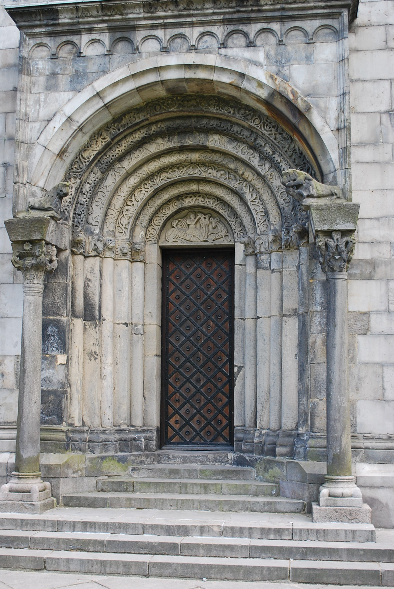
 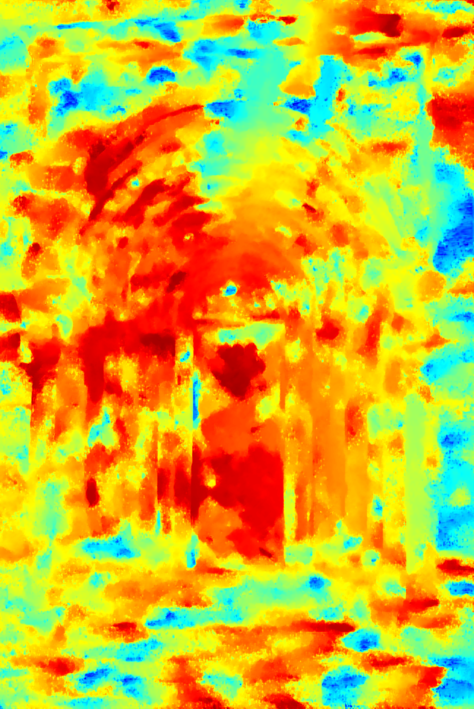
 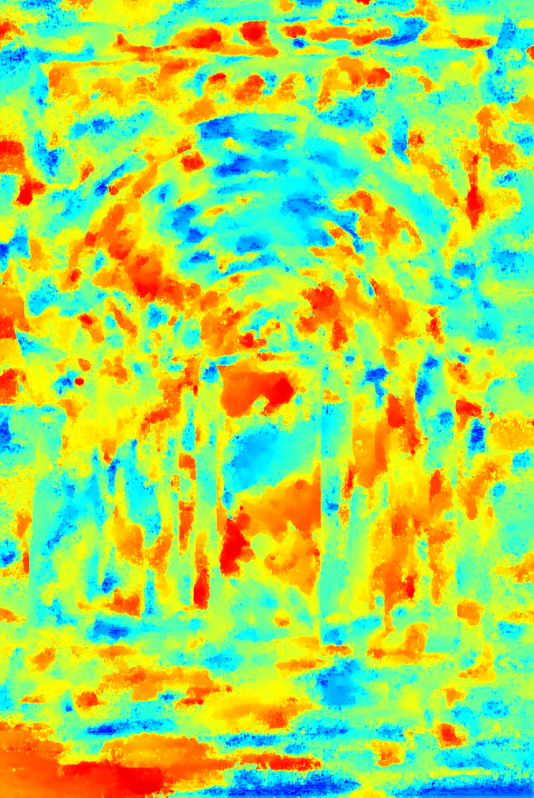
 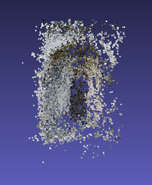
 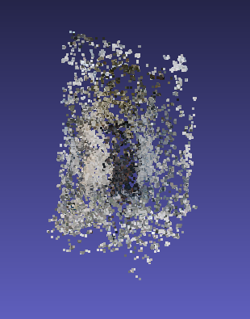
</p> -->

* sample outputs depthmap & mesh of `tests/data/set1_lund_door/images/DSC_0004.JPG`. 
  * origin image, gtsfm cams + mvsnet, COLMAP_cams + mvsnet, COLMAP only
 
<p>
 
 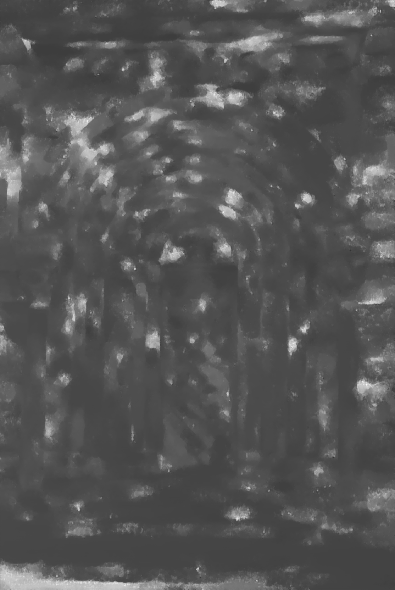
 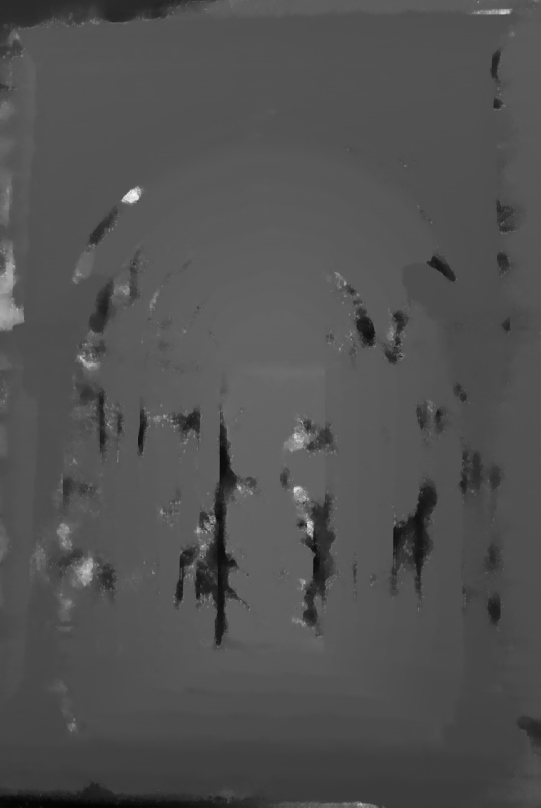
 
 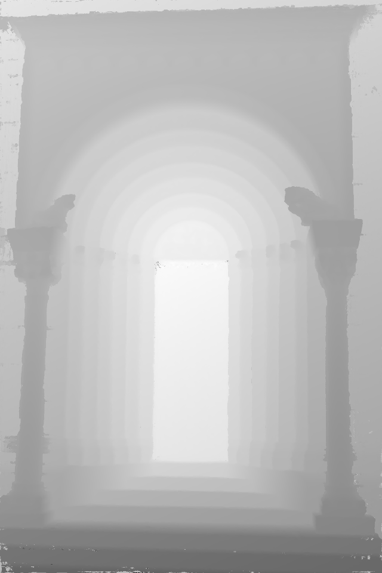
</p>

  *  gtsfm cams + mvsnet, COLMAP_cams + mvsnet
<p>
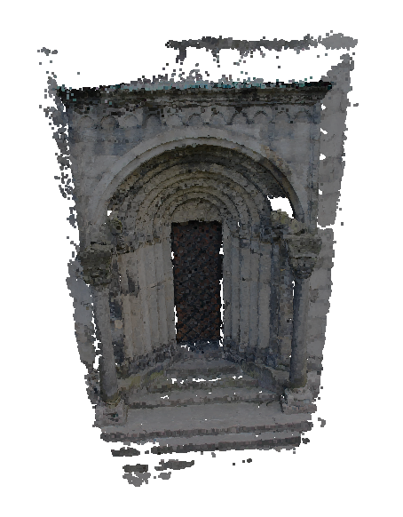
 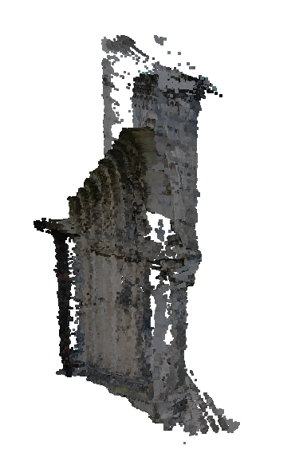
 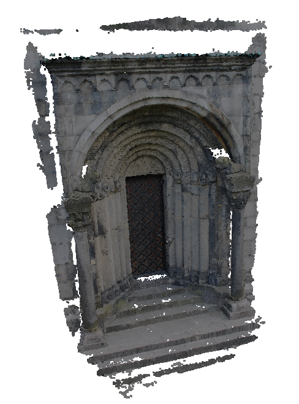
 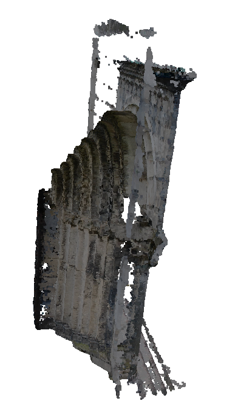
</p>


#### TODOs & Graphs

- [ ] Find metrics
- [ ] Add unit tests
- [ ] Mesh Refinement

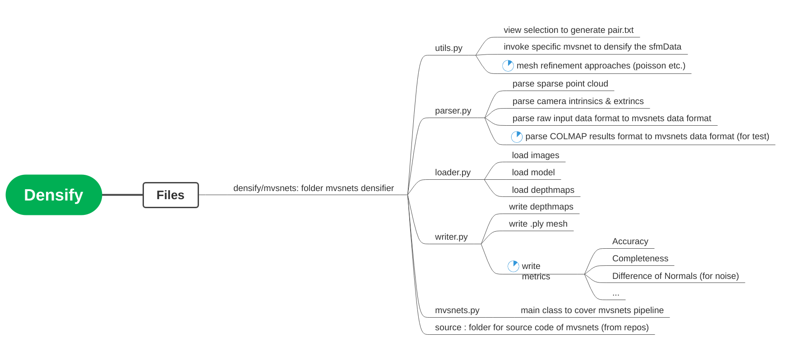

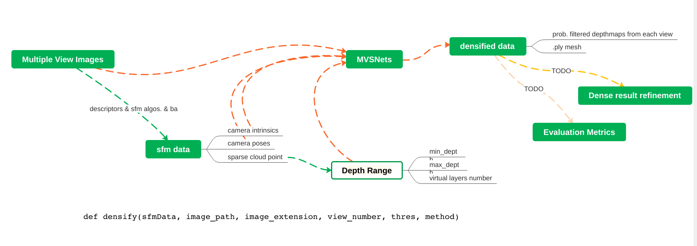

#### References

* Currently the densify module is based on the work of Fangjinhua Wang et al., PatchmatchNet: [Learned Multi-View Patchmatch Stereo](https://arxiv.org/abs/2012.01411). Codes in `densify/mvsnets/source/PatchmatchNet` is mainly based on its corresponding [repository](https://github.com/FangjinhuaWang/PatchmatchNet).

* The View Selection part (in `densify/mvsnets/mvsUtils.py`) is based on Yao et al.'s work [MVSNet: Depth Inference for Unstructured Multi-view Stereo](https://arxiv.org/abs/1804.02505).

