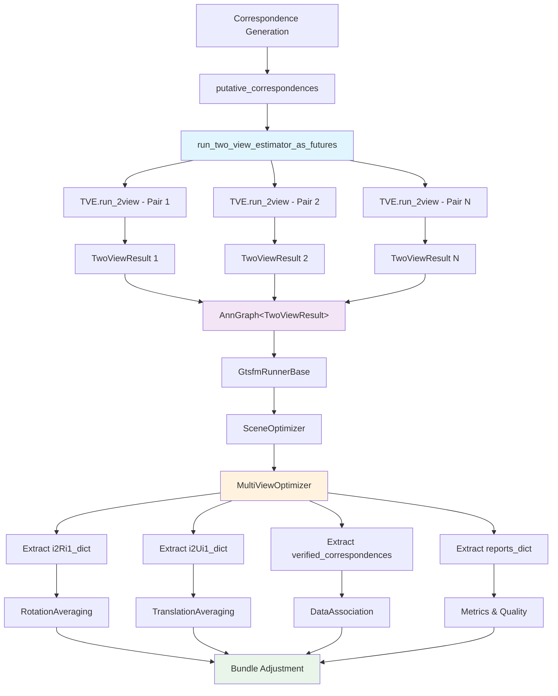

# The Lifecycle of a TwoViewResult

This document provides a systematic overview of how `TwoViewResult` objects are created, modified, and consumed throughout the GTSFM frontend pipeline.

## Overview

The `TwoViewResult` dataclass is the primary data structure for passing two-view estimation results through the GTSFM pipeline. It encapsulates pose estimates, verified correspondences, and detailed reports from each stage of processing.

```python
@dataclasses.dataclass
class TwoViewResult:
    i2Ri1: Optional[Rot3]                           # Relative rotation (final)
    i2Ui1: Optional[Unit3]                          # Relative unit translation (final)  
    v_corr_idxs: np.ndarray                         # Verified correspondence indices (final)
    pre_ba_report: Optional[TwoViewEstimationReport]  # Before bundle adjustment
    post_ba_report: Optional[TwoViewEstimationReport] # After bundle adjustment  
    post_isp_report: Optional[TwoViewEstimationReport] # After inlier support processing
```

## Data Flow Overview



## Stage 1: Creation - TVE.run_2view()

**Location:** [`gtsfm/two_view_estimator.py:run_2view()`](../two_view_estimator.py)

The `TwoViewResult` is **created once** at the end of the two-view estimation pipeline in the `run_2view()` method and contains the final results from all processing stages.

### Input Sources
- **Putative Correspondences:** Pre-computed from correspondence generator
- **Verifier:** Computes initial pose estimates and verified correspondences  
- **Bundle Adjustment:** Refines pose estimates (optional)
- **Inlier Support Processor:** Applies final filtering and validation

### Creation Process
```python
def run_2view(self, keypoints_i1: Keypoints, keypoints_i2: Keypoints, 
              putative_corr_idxs: np.ndarray, ...) -> TwoViewResult:
    
    # 1. Verify correspondences and estimate initial pose
    (pre_ba_i2Ri1, pre_ba_i2Ui1, pre_ba_v_corr_idxs, pre_ba_inlier_ratio_wrt_estimate) = self._verifier.verify(
        keypoints_i1, keypoints_i2, putative_corr_idxs, 
        camera_intrinsics_i1, camera_intrinsics_i2
    )
    pre_ba_report = self.__get_2view_report_from_results(...)
    
    # 2. Optional bundle adjustment refinement
    if self._run_bundle_adjustment:
        (post_ba_i2Ri1, post_ba_i2Ui1, post_ba_v_corr_idxs, post_ba_report) = self._bundle_adjust_2view(...)
    else:
        # Use pre-BA results
        post_ba_i2Ri1, post_ba_i2Ui1, post_ba_v_corr_idxs = pre_ba_i2Ri1, pre_ba_i2Ui1, pre_ba_v_corr_idxs
        post_ba_report = dataclasses.replace(pre_ba_report)
    
    # 3. Final inlier support processing
    (post_isp_i2Ri1, post_isp_i2Ui1, post_isp_v_corr_idxs, post_isp_report) = self.processor.run_inlier_support(...)
    
    # 4. Create final TwoViewResult
    return TwoViewResult(
        i2Ri1=post_isp_i2Ri1,           # Final pose estimate
        i2Ui1=post_isp_i2Ui1,           # Final pose estimate  
        v_corr_idxs=post_isp_v_corr_idxs, # Final correspondences
        pre_ba_report=pre_ba_report,     # Historical data
        post_ba_report=post_ba_report,   # Historical data
        post_isp_report=post_isp_report  # Final validation report
    )
```

### Key Principle
- **The pose fields (`i2Ri1`, `i2Ui1`, `v_corr_idxs`) always contain the FINAL results** after all processing stages
- **The report fields preserve the complete history** of processing for debugging and metrics

## Stage 2: Batch Processing - run_two_view_estimator_as_futures()

**Location:** [`gtsfm/two_view_estimator.py:run_two_view_estimator_as_futures()`](../two_view_estimator.py)

Individual `TwoViewResult` objects are created for all image pairs using Dask futures for parallel processing.

### Process
```python
def run_two_view_estimator_as_futures(
    client: Client,
    two_view_estimator: TwoViewEstimator,
    keypoints_list: List[Keypoints],
    putative_correspondences: AnnotatedGraph[np.ndarray],
    ...
) -> Dict[Tuple[int, int], TwoViewResult]:
    
    # Submit TwoViewEstimator.run_2view tasks to Dask workers for all pairs
    futures = []
    for (i1, i2), putative_corr_idxs in putative_correspondences.items():
        future = client.submit(
            apply_two_view_estimator,
            two_view_estimator,
            keypoints_i1=keypoints_list[i1],
            keypoints_i2=keypoints_list[i2],
            putative_corr_idxs=putative_corr_idxs,
            ...
        )
        futures.append(((i1, i2), future))
    
    # Gather all TwoViewResult objects
    two_view_results = {}
    for (i1, i2), future in futures:
        two_view_results[(i1, i2)] = future.result()  # TwoViewResult
    
    return two_view_results
```

### Data Structure
- **Type:** `Dict[Tuple[int, int], TwoViewResult]` = `AnnotatedGraph[TwoViewResult]`
- **Keys:** Image pair indices `(i1, i2)`
- **Values:** Complete `TwoViewResult` objects with all processing history

## Stage 3: Pipeline Entry - GtsfmRunnerBase._run_correspondence_and_two_view()

**Location:** [`gtsfm/runner/gtsfm_runner_base.py:_run_correspondence_and_two_view()`](../runner/gtsfm_runner_base.py)

The runner orchestrates correspondence generation and two-view estimation.

### Process
```python
def _run_correspondence_and_two_view(self, client, visibility_graph, intrinsics):
    # 1. Generate correspondences for all pairs
    keypoints_list, putative_correspondences = self.scene_optimizer.correspondence_generator.generate_correspondences(...)
    
    # 2. Run two-view estimation on all pairs
    two_view_results: AnnotatedGraph[TwoViewResult] = run_two_view_estimator_as_futures(
        client,
        self.scene_optimizer.two_view_estimator,
        keypoints_list,
        putative_correspondences,
        intrinsics,
        self.loader.get_relative_pose_priors(visibility_graph),
        self.loader.get_gt_cameras(),
        gt_scene_mesh=self.loader.get_gt_scene_trimesh(),
    )
    
    return keypoints_list, two_view_results, ...
```

## Stage 4: Scene Optimization - SceneOptimizer.create_computation_graph()

**Location:** [`gtsfm/scene_optimizer.py:create_computation_graph()`](../scene_optimizer.py)

The scene optimizer receives the complete `TwoViewResult` collection and passes it to multi-view optimization.

### Process
```python
def create_computation_graph(self, keypoints_list, two_view_results: AnnotatedGraph[TwoViewResult], ...) -> Delayed:
    # Pass complete TwoViewResult collection to multi-view optimization
    ba_input_data, ba_output_data, _, metrics_list = self.multi_view_optimizer.create_computation_graph(
        images=images,
        num_images=num_images, 
        keypoints_list=keypoints_list,
        two_view_results=two_view_results,  # Complete AnnotatedGraph[TwoViewResult]
        ...
    )
    return ba_output_data
```

## Stage 5: Data Extraction - MultiViewOptimizer.create_computation_graph()

**Location:** [`gtsfm/multi_view_optimizer.py:create_computation_graph()`](../multi_view_optimizer.py)

The multi-view optimizer extracts data from `TwoViewResult` objects for downstream processing.

### Data Extraction
```python
def create_computation_graph(self, two_view_results: AnnotatedGraph[TwoViewResult], ...) -> Tuple[Delayed, ...]:
    # Extract individual dictionaries from TwoViewResult dataclass
    i2Ri1_dict = {
        (i1, i2): output.i2Ri1 for (i1, i2), output in two_view_results.items() if output.i2Ri1 is not None
    }
    i2Ui1_dict = {
        (i1, i2): output.i2Ui1 for (i1, i2), output in two_view_results.items() if output.i2Ui1 is not None  
    }
    verified_correspondences = {(i1, i2): output.v_corr_idxs for (i1, i2), output in two_view_results.items()}
    two_view_reports_dict = {(i1, i2): output.post_isp_report for (i1, i2), output in two_view_results.items()}
```

### Usage Patterns
- **Pose Estimation:** `i2Ri1_dict` and `i2Ui1_dict` used for rotation/translation averaging
- **Data Association:** `verified_correspondences` used for track building  
- **Quality Assessment:** `two_view_reports_dict` used for metrics and filtering

## Stage 6: Specialized Processing - ViewGraphEstimator

**Location:** [`gtsfm/view_graph_estimator/view_graph_estimator_base.py:create_computation_graph()`](view_graph_estimator/view_graph_estimator_base.py)

View graph estimators receive the complete `TwoViewResult` collection and perform additional filtering.

### Process
```python
def create_computation_graph(self, two_view_results: AnnotatedGraph[TwoViewResult], ...) -> Tuple[Delayed, ...]:
    # Extract data for cycle consistency checking
    i2Ri1_dict = {
        (i1, i2): output.i2Ri1 for (i1, i2), output in two_view_results.items() if output.i2Ri1 is not None
    }
    # ... similar for other fields
    
    # Apply cycle consistency filtering
    valid_edges = self._get_valid_input_edges(i2Ri1_dict=i2Ri1_dict, i2Ui1_dict=i2Ui1_dict)
    # ... filtering logic
    
    # Return filtered results for downstream processing
    return (filtered_i2Ri1_graph, filtered_i2Ui1_graph, filtered_v_corr_idxs_graph, ...)
```

## Stage 7: Utility Functions and Analysis

Various utility functions consume the extracted dictionaries:

### Track Building
```python
def get_2d_tracks(correspondences: AnnotatedGraph[np.ndarray], keypoints_list: List[Keypoints]) -> List[SfmTrack2d]:
    # Uses v_corr_idxs from TwoViewResult
```

### Rotation Averaging  
```python
def create_computation_graph(self, i2Ri1_dict: Dict[Tuple[int, int], Optional[Rot3]], ...):
    # Uses i2Ri1 from TwoViewResult
```

### Translation Averaging
```python  
def create_computation_graph(self, i2Ui1_graph: Delayed, ...):
    # Uses i2Ui1 from TwoViewResult
```

## Key Design Principles

### 1. **Single Source of Truth**
- `TwoViewResult` is created once in `run_2view()` and contains the definitive results
- No modification after creation (immutable by convention)

### 2. **Complete History Preservation**  
- All intermediate results (pre-BA, post-BA, post-ISP) are preserved
- Enables debugging, metrics, and analysis of processing stages

### 3. **Type Safety**
- Optional fields handle failures gracefully
- Named fields eliminate positional parameter errors  

## Future Extensions

Areas where `TwoViewResult` usage could be extended:

1. **Frontend Components:** Update verifiers and ISP to return structured results
2. **Utility Functions:** Accept `AnnotatedGraph[TwoViewResult]` directly  
3. **Averaging Modules:** Extract data internally instead of requiring pre-extracted dictionaries
4. **Metrics and Analysis:** Operate on `TwoViewResult` objects for richer analysis
