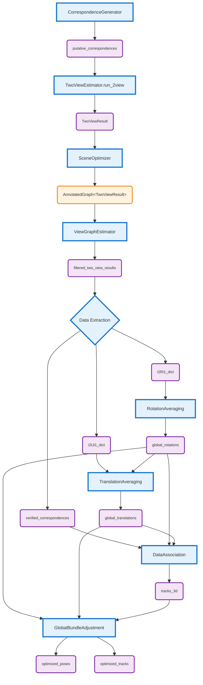

# The Lifecycle of a TwoViewResult

This document provides a concise overview of how [`TwoViewResult`](../products/two_view_result.py) objects flow through the GTSFM pipeline.

## Overview

A `TwoViewResult` is created for each image pair during two-view estimation and contains:
- Relative pose estimates (rotation, translation)
- Verified correspondences 
- Bundle adjustment results
- Processing reports and metrics

## Data Flow

## Pipeline Dependencies

1. **[`RotationAveraging.run_rotation_averaging()`](../averaging/rotation/rotation_averaging_base.py)** takes `i2Ri1_dict` and produces `wRi_list`
2. **[`TranslationAveraging.run_translation_averaging()`](../averaging/translation/translation_averaging_base.py)** takes `i2Ui1_dict` AND `wRi_list` from rotation averaging
3. **[`DataAssociation`](../data_association/data_association_base.py)** takes `verified_correspondences`, `wRi_list`, AND `wti_list` from translation averaging
