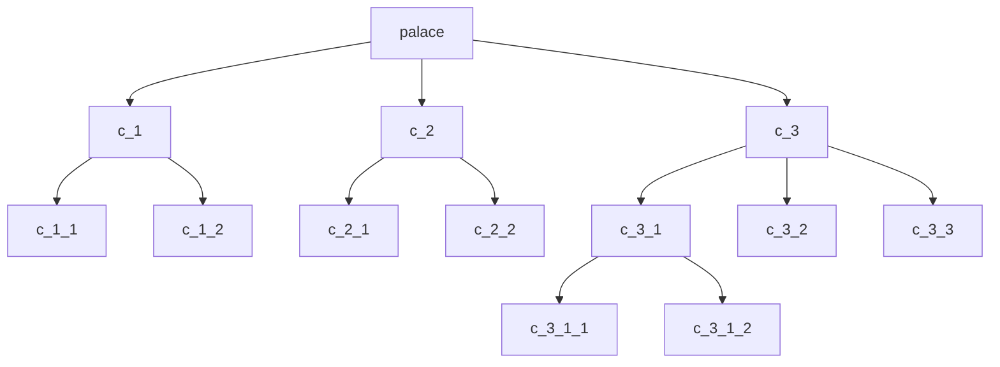

# Palace COLMAP Tree Data

This directory contains a downsampled COLMAP scene tree produced by the notebook `notebooks/downsampling_scene_tree.ipynb`. The tree structure represents hierarchical clustering of COLMAP reconstructions, with each subdirectory corresponding to a cluster or subscene. Leaf nodes contain COLMAP-format files describing camera intrinsics, poses, and 3D points for that subscene.

## Directory Structure
- `ba_output/` and nested `ba_output/` folders: COLMAP output files for each cluster or subscene. Each contains:
  - `cameras.txt`: Camera intrinsics for each image.
  - `images.txt`: Camera poses and 2D-3D correspondences for each image.
  - `points3D.txt`: 3D point cloud and color information.
- `c_1/`, `c_2/`, `c_3/`: Top-level clusters, each with further nested clusters and COLMAP outputs.

## Hierarchy Diagram

## How to Use
- use `./viz -b tests/data/palace` to view
- The tree can be read using `scene_tree.read_colmap` for further processing.
- The COLMAP files in each `ba_output/` folder can be loaded using standard COLMAP tools or parsers.
- The clustering and downsampling process is described and reproducible via `notebooks/downsampling_scene_tree.ipynb`.

## Other Files
- `cluster_tree.pkl`: Pickle file storing the hierarchical tree structure of clusters.
- `poses.pkl`: Pickle file with camera poses for the scene.
- `visibility_graph.csv`: CSV file listing image pairs with visibility edges (columns: `i`, `j`).
- `netvlad_similarity_matrix.txt`: Text file with NetVLAD image similarity scores (matrix format).

