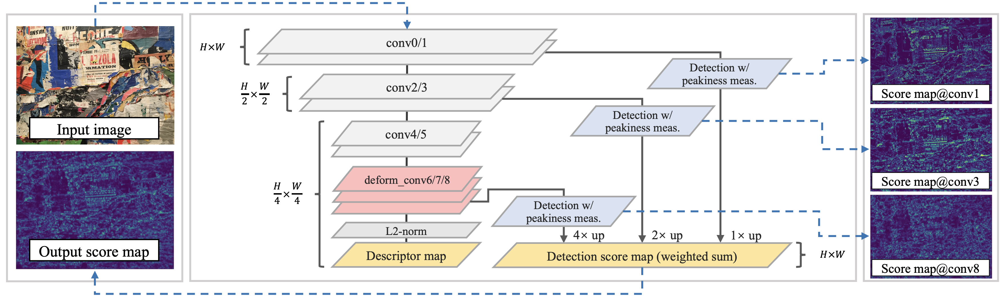
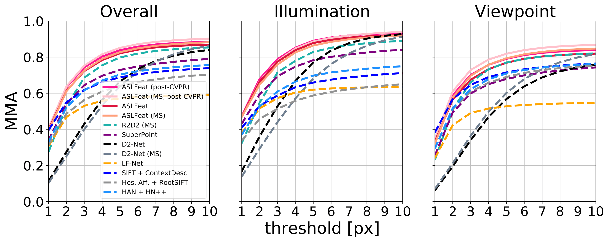

# ASLFeat implementation



TensorFlow implementation of ASLFeat for CVPR'20 paper ["ASLFeat: Learning Local Features of Accurate Shape and Localization"](https://arxiv.org/abs/2003.10071), by Zixin Luo, Lei Zhou, Xuyang Bai, Hongkai Chen, Jiahui Zhang, Yao Yao, Shiwei Li, Tian Fang and Long Quan.

This paper presents a joint learning framework of local feature detectors and descriptors. Two aspects are addressed to learn a powerful feature: 1) shape-awareness of feature points, and 2) the localization accuracy of keypoints. If you find this project useful, please cite:

```
@article{luo2020aslfeat,
  title={ASLFeat: Learning Local Features of Accurate Shape and Localization},
  author={Luo, Zixin and Zhou, Lei and Bai, Xuyang and Chen, Hongkai and Zhang, Jiahui and Yao, Yao and Li, Shiwei and Fang, Tian and Quan, Long},
  journal={Computer Vision and Pattern Recognition (CVPR)},
  year={2020}
}
```

## Requirements

Please use Python 3.7, install NumPy, OpenCV (3.4.2) and TensorFlow (1.15.2). Refer to [requirements.txt](requirements.txt) for some other dependencies.

If you are using conda, you may configure ASLFeat as:

```bash
conda create --name aslfeat python=3.7 -y && \
pip install -r requirements.txt && \
conda activate aslfeat
```

## 4/14/2020 Update

We here release ASLFeat with post-CVPR update, which we find to perform consistently better among the evaluations. The model can be accessed by:

```bash
wget https://research.altizure.com/data/aslfeat_models/aslfeatv2.tar
```

On HPatches dataset, the MMA@3 is improved from 72.29 to 74.31 in single scale prediction, while the multi-scale prediction now achieves 75.26. The major difference comes from 1) using blended images and rendered depths, which is proposed in [BlendedMVS](https://github.com/YoYo000/BlendedMVS) and integrated in [GL3D](https://github.com/lzx551402/GL3D), 2) using [circle loss](https://arxiv.org/abs/2002.10857) and 3) conducting early stopping. Details can be found in the updated arxiv paper. The above implementation is also available in [TFMatch](https://github.com/lzx551402/tfmatch).

## Get started

Clone the repo and download the pretrained model:
```bash
git clone https://github.com/lzx551402/aslfeat.git && \
cd ASLFeat/pretrained && \
wget https://research.altizure.com/data/aslfeat_models/aslfeat.tar && \
tar -xvf aslfeat.tar
```

A quick example for image matching can be called by:

```bash
cd /local/aslfeat && python image_matching.py --config configs/matching_eval.yaml
```

You will be able to see the matching results by displaying [disp.jpg](imgs/disp.jpg).

You may configure ``configs/matching_eval.yaml`` to test images of your own.

## Training scripts

We release the training scripts in a separate project, [TFMatch](https://github.com/lzx551402/tfmatch), which also contains our previous research works ([GeoDesc](https://github.com/lzx551402/geodesc), ECCV'18 and [ContextDesc](https://github.com/lzx551402/contextdesc), CVPR'19).

## Evaluation scripts

### 1. Benchmark on [HPatches dataset](http://icvl.ee.ic.ac.uk/vbalnt/hpatches)

Download the original sequences (i.e., ``hpatches-sequences-release.tar.gz``), configure ``configs/hseq_eval.yaml``, and call:

```bash
cd /local/aslfeat && python hseq_eval.py --config configs/hseq_eval.yaml
```

At the end of running, we report the average number of features, repeatability, precision, matching score, recall and mean matching accuracy (a.k.a. MMA). The evaluation results will be displayed as:
```bash
0 /data/hpatches-sequences-release/v_abstract
5000 [0.65887743 0.7993664  0.49892387 0.73872983 0.7671514  0.6]
1 /data/hpatches-sequences-release/v_adam
1620 [0.6605903  0.88857824 0.45584163 0.6810486  0.88263476 0.6]
...
----------i_eval_stats----------
...
----------v_eval_stats----------
...
----------all_eval_stats----------
avg_n_feat 3924
avg_rep 0.62246275
avg_precision 0.73995966
avg_matching_score 0.41950417
avg_recall 0.63767093
avg_MMA 0.7228764
avg_homography_accuracy 0.72037053
```

As a reference, ASLFeat with post-CVPR update achieves:
```bash
----------all_eval_stats----------
avg_n_feat 3617
avg_rep 0.6026927 
avg_precision 0.75740457 
avg_matching_score 0.42784035 
avg_recall 0.6682571 
avg_MMA 0.74305236 
avg_homography_accuracy 0.7314815
```

When multi-scale (MS) inference is enabled, the results become:
```bash
----------all_eval_stats----------
avg_n_feat 4241
avg_rep 0.6737002
avg_precision 0.7681067
avg_matching_score 0.41503817
avg_recall 0.58123404
avg_MMA 0.7526477
avg_homography_accuracy 0.7537038
```

The results for repeatability and matching score is different from what we have reported in the paper, as we now apply a [symmetric check](https://github.com/lzx551402/ASLFeat/commit/0df33b75453d73af28927f203a2892a0acf6956f) when counting the number of covisible features (referring to [SuperPoint](https://github.com/rpautrat/SuperPoint)). This change may not influence the conclusion in the section of ablation study, but would be useful for making comparision with other relavant papers. We thank for [Sida Peng](https://pengsida.net/) for pointing this out when reproducing this work.

To plot the results (i.e., reproduce Fig.3 in the paper, shown below), please include the [cached files](cache/), use the tool provided by [D2-Net](https://github.com/mihaidusmanu/d2-net/blob/master/hpatches_sequences/HPatches-Sequences-Matching-Benchmark.ipynb).



### 2. Benchmark on [FM-Bench](http://jwbian.net/fm-bench)

Download the (customized for data loading and randomness eschewing) evaluation pipeline, and follow the instruction to download the [testing data](https://1drv.ms/f/s!AiV6XqkxJHE2g3ZC4zYYR05eEY_m):
```bash
git clone https://github.com/lzx551402/FM-Bench.git
```

Configure ``configs/fmbench_eval.yaml`` and call:

```bash
cd /local/aslfeat && python evaluations.py --config configs/fmbench_eval.yaml
```

The extracted features will be stored in ``FM-Bench/Features_aslfeat``. Use Matlab to run ``Pipeline/Pipeline_Demo.m"`` then ``Evaluation/Evaluate.m`` to obtain the results.

The cached results of ASLFeat can be reached [here](https://research.altizure.com/data/aslfeat_models/Results.tar).

### 3. Benchmark on [visual localization](https://www.visuallocalization.net/)

Download the [Aachen Day-Night dataset](https://www.visuallocalization.net/datasets/) and follow the [instructions](https://github.com/tsattler/visuallocalizationbenchmark) to configure the evaluation.

Configure ``data_root`` in ``configs/aachen_eval.yaml``, and call:

```bash
cd /local/aslfeat && python evaluations.py --config configs/aachen_eval.yaml
```

The extracted features will be saved alongside their corresponding images, e.g., the features for image ``/local/Aachen_Day-Night/images/images_upright/db/1000.jpg`` will be in the file ``/local/Aachen_Day-Night/images/image_upright/db/1000.jpg.aslfeat`` (the method name here is ``aslfeat``).

Finally, refer to the [evaluation script](https://github.com/tsattler/visuallocalizationbenchmark/blob/master/local_feature_evaluation/reconstruction_pipeline.py) to generate and submit the results to the challenge website.

### 4. Benchmark on [Oxford Buildings dataset](https://www.robots.ox.ac.uk/~vgg/data/oxbuildings/) for image retrieval

Take [Oxford Buildings dataset](https://www.robots.ox.ac.uk/~vgg/data/oxbuildings/) as an example. First, download the evaluation data and (parsed) groundtruth files:

```bash
mkdir Oxford5k && \
cd Oxford5k && \
mkdir images && \
wget https://www.robots.ox.ac.uk/~vgg/data/oxbuildings/oxbuild_images.tgz && \
tar -xvf oxbuild_images.tgz -C images && \
wget https://research.altizure.com/data/aslfeat_models/oxford5k_gt_files.tar && \
tar -xvf ... 
```

This script also allows for evaluating [Paris dataset](https://www.robots.ox.ac.uk/~vgg/data/parisbuildings/). The (parsed) groundtruth files can be found [here](https://research.altizure.com/data/aslfeat_models/paris6k_gt_files.tar). Be noted to delete the [corrupted images](https://www.robots.ox.ac.uk/~vgg/data/parisbuildings/corrupt.txt) of the dataset, and put the remaining images under the same folder.

Next, configure ``configs/oxford_eval.yaml``, and extract the features by:

```bash
cd /local/aslfeat && python evaluations.py --config configs/oxford_eval.yaml
```

We use Bag-of-Words (BoW) method for image retrieval. To do so, clone and compile [libvot](https://github.com/hlzz/libvot.git):

```bash
cd Oxford5k && \
git clone https://github.com/hlzz/libvot.git && \
mkdir build && \
cd build && \
cmake -DLIBVOT_BUILD_TESTS=OFF -DLIBVOT_USE_OPENCV=OFF .. && \
make
```

and the mAP can be obtained by:

```bash
cd Oxford5k && \
python benchmark.py --method_name aslfeat_ms
```

Please cite [libvot](https://github.com/hlzz/libvot.git) if you find it useful.

### 5. Benchmark on [ETH dataset](https://github.com/ahojnnes/local-feature-evaluation)

Follow the [instruction](https://github.com/ahojnnes/local-feature-evaluation/blob/master/INSTRUCTIONS.md) to download the data, configure ``configs/eth_eval.yaml`` and call:

```bash
cda /local/aslfeat && python evaluations.py --config configs/eth_eval.yaml
```

To extract the features.

### 6. Benchmark on [IMW2020](https://vision.uvic.ca/image-matching-challenge/) 

Download the data (validation/test) [Link](https://vision.uvic.ca/imw-challenge/index.md), then configure ``configs/imw2020_eval.yaml``, finally call:

```bash
cd /local/aslfeat && python evaluations.py --config configs/imw2020_eval.yaml
```

## Misc 

1. Training data is provided in [GL3D](https://github.com/lzx551402/GL3D).

2. You might be also interested in a 3D local feature ([D3Feat](https://github.com/XuyangBai/D3Feat/)).

## Acknowledgements

1. The backbone networks and the learning scheme are heavily borrowed from [D2-Net](https://github.com/mihaidusmanu/d2-net).

2. We thank for the authors of [R2D2](https://github.com/naver/r2d2) for sharing their evaluation results on HPatches that helped us plot Fig.1. The updated results of R2D2 are even more excited.

3. We refer to the public implementation of [SuperPoint](https://github.com/rpautrat/SuperPoint) for organizing the code and implementing the evaluation metrics.

4. We implement the modulated DCN referring to [this](https://github.com/DHZS/tf-deformable-conv-layer/blob/master/nets/deformable_conv_layer.py). The current implementation is not efficient, and we expect a native implementation in TensorFlow to be available in the future. (update: this [contribution](https://github.com/tensorflow/addons/pull/1129) would be extremely useful once it is integrated!)

